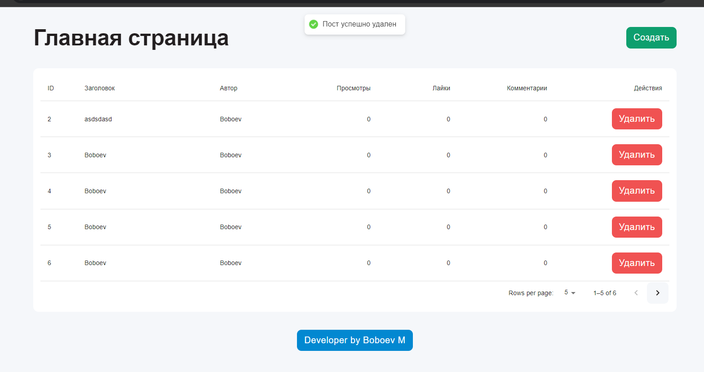

## Description
This project is designed for creating, editing, and managing posts. It provides a user-friendly interface for interacting with posts and their metadata.




## Libraries and Technologies Used
- **React**: A library for building user interfaces.
- **Vite**: A tool for fast frontend build.
- **TypeScript**: A superset of JavaScript that adds static typing.
- **Material-UI**: Components for React implementing Material Design.
- **React Query**: State and server data management.
- **Zustand**: A lightweight state management library.
- **React Hook Form**: Form handling in React.
- **Yup**: Schema validation.
- **react-hot-toast**: Notifications in React.

## Project Tasks
- Creating, editing, and deleting posts.
- Managing application state.
- Handling and validating forms.
- Managing data fetched from the server.
- Creating a modern and user-friendly interface.
- Displaying notifications to users.
- Fast build and development of the application.
- Ensuring static typing and improving code quality.

## Running the Project
- Start the JSON server:
  ```sh
  npx json-server --watch db.json --port 3000
  

# React + TypeScript + Vite

This template provides a minimal setup to get React working in Vite with HMR and some ESLint rules.

Currently, two official plugins are available:

- [@vitejs/plugin-react](https://github.com/vitejs/vite-plugin-react/blob/main/packages/plugin-react/README.md) uses [Babel](https://babeljs.io/) for Fast Refresh
- [@vitejs/plugin-react-swc](https://github.com/vitejs/vite-plugin-react-swc) uses [SWC](https://swc.rs/) for Fast Refresh

## Expanding the ESLint configuration

If you are developing a production application, we recommend updating the configuration to enable type aware lint rules:

- Configure the top-level `parserOptions` property like this:

```js
export default {
  // other rules...
  parserOptions: {
    ecmaVersion: 'latest',
    sourceType: 'module',
    project: ['./tsconfig.json', './tsconfig.node.json', './tsconfig.app.json'],
    tsconfigRootDir: __dirname,
  },
}
```

- Replace `plugin:@typescript-eslint/recommended` to `plugin:@typescript-eslint/recommended-type-checked` or `plugin:@typescript-eslint/strict-type-checked`
- Optionally add `plugin:@typescript-eslint/stylistic-type-checked`
- Install [eslint-plugin-react](https://github.com/jsx-eslint/eslint-plugin-react) and add `plugin:react/recommended` & `plugin:react/jsx-runtime` to the `extends` list
